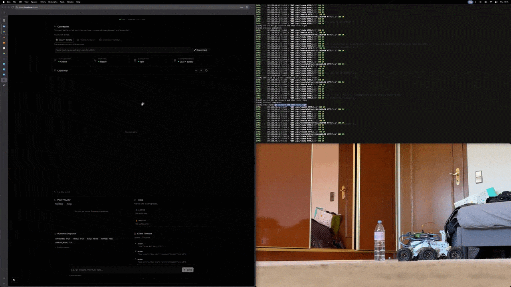

# NLP autonomous robot

## Demo



Add your clip as **`assets/demo.gif`** (GitHub shows GIFs inline in the README). For a longer HD video you can still link YouTube/Vimeo under this image.

---

Small mobile robot controlled by natural language: commands become a symbolic plan (LLM or rules), optionally checked by a safety layer, then executed on hardware.

You can compare two execution modes from the UI or API:
- **LLM** — staged plan executed through the planner / robot executor (typical obstacle handling and logging).
- **Direct** — alternative execution path intended for benchmarking (different mapping and semantics).

## What’s in here

| Area | Role |
|------|------|
| `src/nlp` | Parsing, LLM (OpenRouter) plan JSON, deterministic fallbacks |
| `src/core` | Planner, safety, robot control API |
| `src/app` | FastAPI backend for a separate web UI (`/api`, `/docs`) |
| `src/real` | Real robot bindings |
| `src/logging` | Optional session logger that polls `/api/events` |

## How it works

1. **Natural language in** — Operator text comes from the CLI or the FastAPI routes (e.g. `/api/execute` after `/api/connect`).

2. **Command → plan** — `resolve_command_plan` turns text into a **list of JSON steps** (`move_forward`, `turn_left`, `stop`, `scan_360`, each with optional `duration`, `speed`, `until`, etc.):
   - **`rules`** — rule-based / spaCy pipeline when that mode is selected.
   - **`llm` / `direct`** — OpenRouter builds a plan when the request succeeds; for a few fixed English patterns a **deterministic parser** runs first and skips the network; if the model or network fails, a **keyword heuristic** fills in (weaker on long or compound sentences).

3. **Two runtimes** (chosen by `mode` on the request):
   - **`llm`** — `RobotExecutor` runs the plan step by step: `SafetyController` may rewrite a step using `WorldModel`, then `ControlAPI` maps JSON to `Planner` intents (time-limited move, move until obstacle, turns, scan). If **forward** stops on an **obstacle** and the plan still has **more steps**, execution can **continue** with the next step; if that was the **last** step, the task ends as interrupted.
   - **`direct`** — `DirectExecutor` runs the **same structured plan** through a **separate** execution path (different mapping and semantics; useful for comparisons — see `direct_executor.py`).

4. **Robot I/O** — `Planner` talks to `RealRobot` over **USB serial** (port/baud from env). Telemetry updates the world model and feeds safety / obstacle logic.

5. **Events** — Plans and outcomes are recorded for `/api/events` (and optional `src.logging.live_metrics_logger`) so the UI or offline analysis can correlate commands, `plan_source`, and completion.

## Setup

```bash
python -m pip install -r requirements.txt
python -m spacy download en_core_web_sm
```

The backend loads `.env` from the project directory (via `python-dotenv` where wired). You can export the same names in your shell instead.

### Environment variables

| Variable | Notes |
|----------|--------|
| `OPENROUTER_API_KEY` | Required for NL → plan via OpenRouter (LLM / `direct` plan path when not using deterministic fallbacks). |
| `ROBOT_SERIAL_PORT` | USB device for the rover (Linux examples: `/dev/ttyUSB0`, `/dev/ttyACM0`). If unset or missing on disk, the code tries common ports, then defaults to `/dev/ttyUSB0`. |
| `ROBOT_BAUDRATE` | Serial baud rate; default **`115200`** if unset or invalid. |

**Optional elsewhere in the stack:** `LLM_INTENT_MODEL` (default `openrouter/auto`), `WEB_CORS_ORIGINS` for the FastAPI app (comma-separated origins; see `web_api`). Motor tuning: `MOTOR_LEFT_TRIM`, `MOTOR_RIGHT_TRIM`, `MOTOR_LEFT_OFFSET`, `MOTOR_RIGHT_OFFSET` (`real_robot`).

## Run

**CLI:**

```bash
python -m src.app.main
```

**Web backend** (run from repo root):

```bash
export PYTHONPATH="$PWD"
python -m src.app.web_api
```

Docs: http://localhost:8000/docs  
Point your frontend at the same origin or set CORS (`WEB_CORS_ORIGINS`) as needed.

**Session logging** while the backend is up:

```bash
export PYTHONPATH="$PWD"
python -m src.logging.live_metrics_logger --base-url http://127.0.0.1:8000
```

Writes under `results/live_session_<timestamp>/`: `events.jsonl`, `per_command.csv`, and `manifest.json`. Use `--output-dir` for a fixed folder.
